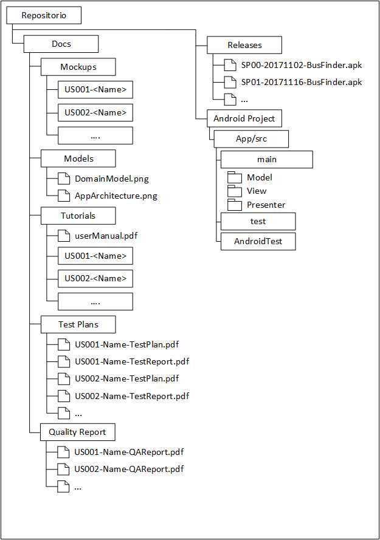

# Proyecto Base

Contiene un proyecto base con la estructura de directorios a utilizar en el proyecto integrado de ingeniería del software de la UC. 

Además incluye un prototipo de aplicación con algunas funcionalidades: vista de lista, vista de detalle y carga de datos remotos.

